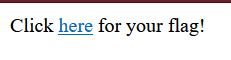
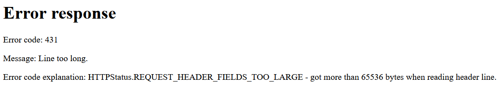
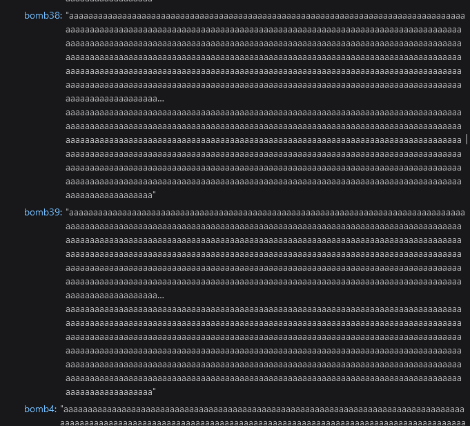
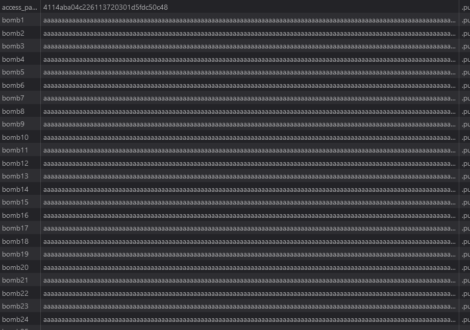

# Overcooked
Visiting ```http://puzzler7.imaginaryctf.org:9002/``` we get a simple page:


Clicking the link, we get a rare error message:


Investigating the network tab, we can see that the cookies tab is full of "bomb" cookies:


Looking at the storage tab, we can see that there is also a ```access_password``` cookie that likely is necessary to get the flag. 


By removing all of the bomb cookies and refreshing the page, we get the flag.