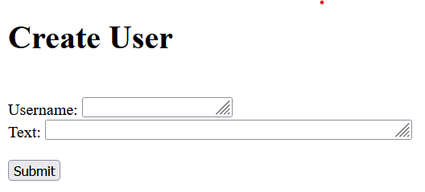
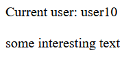

# Unique
### 12-02-2022

The provided url gives us the source code for the Flask server running on

```
#!/usr/bin/env python3

from flask import Flask, request, Response, redirect
from flask_limiter import Limiter
from flask_limiter.util import get_remote_address
from uuid import NAMESPACE_OID, uuid5 as uuid4

app = Flask(__name__)
limiter = Limiter(
    app,
    key_func=get_remote_address,
    default_limits=["50000 per hour"],
    storage_uri="memory://",
)

user_db = {}
usernames = set()

class User:
    def __init__(self, username, text):
        if username in usernames:
            self.secret_uid = None
            return
        usernames.add(username)
        self.username = username
        self.text = text
        self.secret_uid = str(uuid4(NAMESPACE_OID, username))
        user_db[self.secret_uid] = self


@app.route('/')
@limiter.limit("5/second")
def index():
    return Response(open(__file__).read(), mimetype='text/plain')

@app.route('/new', methods=['GET'])
@limiter.limit("5/second")
def new_get():
    return open("new.html").read()

@app.route('/new', methods=['POST'])
@limiter.limit("5/second")
def new_push():
    text = request.form['text']
    user = request.form["user"]
    new_user = User(user, text)
    return redirect(f"/user/{new_user.secret_uid}")

@app.route('/user/<user_id>', methods=['GET'])
@limiter.limit("5/second")
def user_get(user_id):
    if user_id == "None":
        return "That user doesn't exist!"
    user = user_db[user_id]
    return  f"Current user: {user.username}<br><br>{user.text}"
    

User("puzzler7", open("flag.txt").read())
app.run('0.0.0.0', 8000)
```

This reveals 3 new endpoints
- /new (GET)
- /new (POST)
- /user/<user_id> (GET)

visiting http://puzzler7.imaginaryctf.org:8000/new returns a form to create a new User object, defined in line 19.



Creating a new user with
- Username: ```user10```
- Text: ```some interesting text```

Redirects us to http://puzzler7.imaginaryctf.org:8000/user/ff5c6b7b-d1b1-59e7-8fe3-1327cd643738, which reveals the text associated with a given user. The url-encoding scheme is defined on line 49, using the secret_uid field to lookup the correct User object in the database.


We can see on line 58 that we will be able to recover the flag by accessing the database entry for the user ```puzzler7```.

The secret_uid field is generated in line 27 with the following code

```self.secret_uid = str(uuid4(NAMESPACE_OID, username))```

In line 6, we can see that the uuid5 method has been aliased to uuid. As such, I used the following script to recover the secret_uid:

```
from uuid import NAMESPACE_OID, uuid5 as uuid4

user = "puzzler7"
secret_uid = str(uuid5(NAMESPACE_OID, user))
print(secret_uid)
```

Success!

The flag can be recovered.